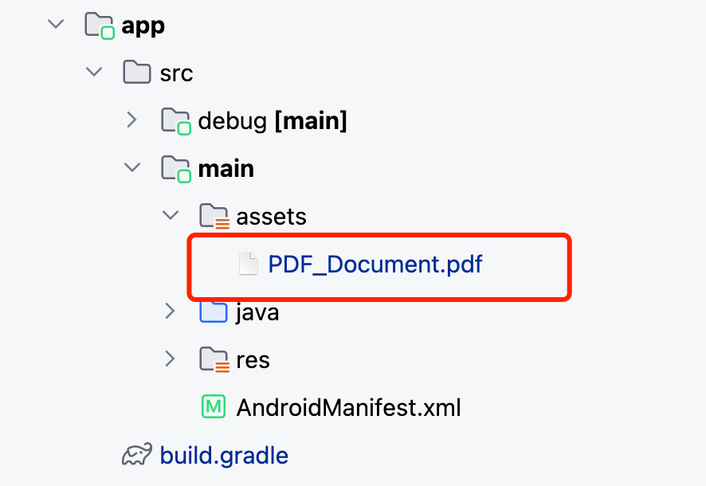
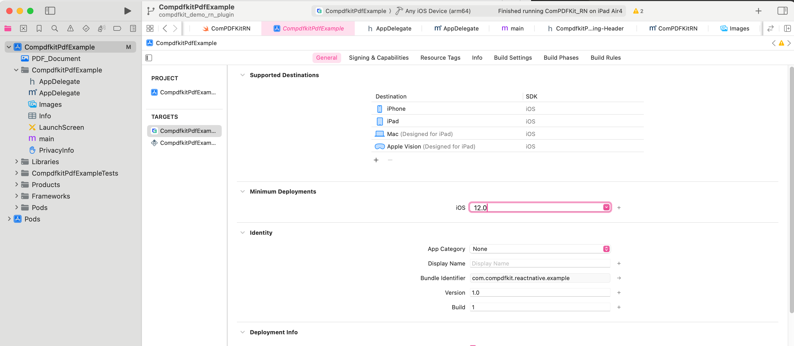

# ComPDFKit React-Native PDF Library

## Overview

[ComPDFKit PDF SDK](https://www.compdf.com) seamlessly operates on [Web](https://www.compdf.com/web), [Windows](https://www.compdf.com/windows), [Android](https://www.compdf.com/android), [iOS](https://www.compdf.com/ios), [Mac](https://www.compdf.com/contact-sales), and [Server](https://www.compdf.com/server), with support for cross-platform frameworks such as [React Native](https://www.compdf.com/react-native), [Flutter](https://www.compdf.com/flutter), etc.

[ComPDFKit for React Native](https://www.compdf.com/react-native) allows you to quickly and seamlessly add PDF functions to any React Native application, elevating your Android and iOS apps with annotations, content editing, conversion, data extraction, etc.

## Related

- [ComPDFKit PDF Library for iOS](https://github.com/ComPDFKit/PDF-SDK-iOS)
- [ComPDFKit PDF Library for Android](https://github.com/ComPDFKit/PDF-SDK-Android)
- ComPDFKit PDF SDK - [Flutter Library](https://pub.dev/packages/compdfkit_flutter)
- [How to Build a React Native PDF Viewer](https://www.compdf.com/blog/build-a-react-native-pdf-viewer)
- Recognize and extract data from PDFs with our online [Extract Demo](https://www.compdf.com/pdf-extract/demo)
- [ComPDFKit API](https://api.compdf.com/api/pricing) allows you to get 1000 files processing monthly now! Just [sign up](https://api.compdf.com/signup) for a free trial and enjoy comprehensive PDF functions.

## Prerequisites

* A license is required for trial. Please contact our [sales team](https://www.compdf.com/contact-sales) to obtain a free trial license.
* npm or yarn
* ComPDFKit SDK => 2.0.1
* react-native => 0.71.0
* Android `minSdkVersion` of `21` or higher
* Android `targetSdkVersion` of `30` or higher
* iOS 12 or higher

## Installation

First, please follow the official [React Native environment setup guide](https://reactnative.dev/docs/environment-setup), configure [iOS and Android environments](https://reactnative.dev/docs/environment-setup), and create a [React Native project](https://reactnative.dev/docs/environment-setup).

If you have already created a React Native project, you can skip directly to [Installing the ComPDFKit Dependency](#Installing-the-ComPDFKit-Dependency).

### Creating a New Project

Let's create a simple app that integrates ComPDFKit for React Native.

1. In the terminal app, change the current working directory to the location you wish to save your project. In this example, we’ll use the `~/Documents/` directory:

   ```bash
   cd ~/Documents
   ```
2. Create the React Native project by running the following command:

   ```bash
   react-native init MyApp
   ```
3. In the terminal app, change the location of the current working directory inside the newly created project:

   ```bash
   cd MyApp
   ```

### Installing-the-ComPDFKit-Dependency

You can integrate the SDK in two ways:

* **Through [ComPDFKit GitHub](https://github.com/ComPDFKit/compdfkit-pdf-sdk-react-native) repo:**

  In `MyApp` folder, install `@compdfkit_pdf_sdk/react_native` by calling:

  ```shell
  yarn add github:ComPDFKit/compdfkit-pdf-sdk-react-native
  ```
* **Through [ComPDFKit npm](https://www.npmjs.com/package/@compdfkit_pdf_sdk/react_native) package:**

  In `MyApp` folder, install run the following commands:

  ```
  yarn add @compdfkit_pdf_sdk/react_native
  ```

#### Android

1. open  `android/app/src/main/AndroidManifest.xml` , add  `Internet Permission` and `Storage Permission`：

```diff
<manifest xmlns:android="http://schemas.android.com/apk/res/android"
    package="com.compdfkit.flutter.example">

+    <uses-permission android:name="android.permission.INTERNET"/>

    <!-- Required to read and write documents from device storage -->
+    <uses-permission android:name="android.permission.READ_EXTERNAL_STORAGE"/>
+    <uses-permission android:name="android.permission.WRITE_EXTERNAL_STORAGE"/>

		<!-- Optional settings -->
+    <uses-permission android:name="android.permission.MANAGE_EXTERNAL_STORAGE" />

    <application
+    android:requestLegacyExternalStorage="true"
        ...>
	...
    </application>
</manifest>
```

2. Copy the sample pdf file to the `assets` directory



2. Replace `App.js` (or `App.tsx`) with what is shown for [Usage-Example](#Usage-Example)
3. Finally in the root project directory, run `react-native run-android`.

#### iOS

1. Open your project’s Podfile in a text editor:

```bash
open ios/Podfile
```

2. Add the following line to the `target 'MyApp' do ... end` block:

```diff
target 'MyApp' do
    # ...
+    pod "ComPDFKit", podspec:'https://www.compdf.com/download/ios/cocoapods/xcframeworks/compdfkit/2.3.0.podspec'
+  pod "ComPDFKit_Tools", podspec:'https://www.compdf.com/download/ios/cocoapods/xcframeworks/compdfkit_tools/2.3.0.podspec'
    # ...
end
```

**Note:** If SSL network requests fail to download the `ComPDFKit` library when you run `pod install`, you can use the following method instead.

```diff
target 'MyApp' do
    # ...
+  pod 'ComPDFKit', :git => 'https://github.com/ComPDFKit/compdfkit-pdf-sdk-ios-swift.git', :tag => '2.3.0'
+  pod 'ComPDFKit_Tools', :git => 'https://github.com/ComPDFKit/compdfkit-pdf-sdk-ios-swift.git', :tag => '2.3.0'
    # ...
end
```

3. In the `ios` folder, run `pod install`.
4. Open your project’s Workspace in Xcode:

   ```bash
   open ios/MyApp.xcworkspace
   ```

   Make sure the deployment target is set to 12.0 or higher:

   
5. Add the PDF document you want to display to your application by dragging it into your project. On the dialog that’s displayed, select Finish to accept the default integration options. You can use **"PDF_Document.pdf"** as an example.

   

```
<key>NSCameraUsageDescription</key>
<string>Your consent is required before you could access the function.</string>

<key>NSMicrophoneUsageDescription</key>
<string>Your consent is required before you could access the function.</string>

<key>NSPhotoLibraryAddUsageDescription</key>
<string>Your consent is required before you could access the function.</string>

<key>NSPhotoLibraryUsageDescription</key>
<string>Your consent is required before you could access the function.</string>

<key>NSAppTransportSecurity</key>
<dict>
<key>NSAllowsArbitraryLoads</key>
<true/>
</dict>
```

3. Replace `App.js` (or `App.tsx`) with what is shown for [Usage-Example](#Usage-Example)
4. Finally in the root project directory, run `react-native run-ios`.

### Apply the License Key

Contact [ComPDFKit&#39;s sales team](https://www.compdf.com/contact-sales) to get a free 30-day license to test the project, and [apply the license key](https://www.compdf.com/guides/pdf-sdk/react-native/apply-the-license-key) following the guides.

ComPDFKit for React Native is a commercial SDK, which requires a license to grant developer permission to release their apps. Each license is only valid for one `bundle ID` or `applicationId` in development mode. Other flexible licensing options are also supported, please contact [our marketing team](mailto:support@compdf.com) to know more.

## Usage-Example

After installing from NPM or GitHub, replace `App.tsx` with the following code.

Make sure to follow the above steps to copy the sample document into your Android or iOS project.

Here is the sample code for `App.tsx`:

```tsx
/**
 * Copyright © 2014-2025 PDF Technologies, Inc. All Rights Reserved.
 *
 * THIS SOURCE CODE AND ANY ACCOMPANYING DOCUMENTATION ARE PROTECTED BY INTERNATIONAL COPYRIGHT LAW
 * AND MAY NOT BE RESOLD OR REDISTRIBUTED. USAGE IS BOUND TO THE ComPDFKit LICENSE AGREEMENT.
 * UNAUTHORIZED REPRODUCTION OR DISTRIBUTION IS SUBJECT TO CIVIL AND CRIMINAL PENALTIES.
 * This notice may not be removed from this file.
 */

import React, { Component } from 'react';
import {
    SafeAreaView
} from 'react-native';
import { ComPDFKit, CPDFReaderView } from '@compdfkit_pdf_sdk/react_native';
import { Platform } from 'react-native';

type Props = {};

export default class App extends Component<Props> {

    state = {
        versionCode: ''
    }

    constructor(props: Props) {
        super(props)
        this.initialize()
        this.getVersionCode()
    }

    async getVersionCode() {
        // Get the version code of ComPDFKit SDK
        var version = await ComPDFKit.getVersionCode()
        this.setState({
            versionCode: version
        })
    }

    async initialize() {
        // Online certification, Fill in your online license
        // Returns true if initialization is successful, otherwise returns false.
        // var result = await ComPDFKit.initialize('compdfkit android license', 'compdfkit ios license')
        // console.log("ComPDFKitRN", "initialize:", result)

        // Offline authentication, Fill in your offline license
        var result = await ComPDFKit.init_('compdfkit license')
        console.log("ComPDFKitRN", "init_:", result)
    }

    /**
     * Open the sample document embedded in Android or iOS project.
     */
    openSample() {
        var samplePDF: string = Platform.OS == 'android' ? 'file:///android_asset/PDF_Document.pdf' : 'PDF_Document.pdf'
        // We provide default UI and PDF property related configurations here, you can modify configuration options according to your needs.
        var config = ComPDFKit.getDefaultConfig({

        })
        ComPDFKit.openDocument(samplePDF, '', config)
    }

    samplePDF = Platform.OS === 'android'
        ? 'file:///android_asset/PDF_Document.pdf'
        : 'PDF_Document.pdf';

    const onPageChanged = (pageIndex : number) =>{
        // console.log('ComPDFKitRN --- onPageChanged:', pageIndex);
    }

    const saveDocument = () => {
        console.log('ComPDFKitRN saveDocument');
    }

    render() {
        return (
            <SafeAreaView style={{ flex: 1 }}>
                <CPDFReaderView
                    document={this.samplePDF}
                  	onPageChanged={onPageChanged}
                    saveDocument={saveDocument}
                    configuration={ComPDFKit.getDefaultConfig({})}
                    style={{ flex: 1 }}
                />
            </SafeAreaView>
        );
    }
}
```

* (Android) For local storage file path:

```tsx
document = '/storage/emulated/0/Download/PDF_document.pdf'
```

* (Android) For content Uri:

```tsx
document = 'content://...'
```

* (Android) For assets path:

```tsx
document = "file:///android_asset/..."
```

* (iOS) For app bundle file path:

```tsx
document = "document.pdf"
```

* (iOS) for URL path:

```tsx
document = "file://xxxx/document.pdf"
```

### Configuration

When rendering a PDF view using the `ComPDFKit.openDocument` method or the `CPDFReaderView` UI component , you have the flexibility to enable or disable certain features or adjust default attribute values for PDF annotations, forms, and more through the `CPDFConfiguration` settings.

For your convenience, you can obtain default attribute values by using the `ComPDFKit.getDefaultConfig({})` method.

The following example demonstrates the configuration settings for some aspects. For more detailed configuration options, refer to [CONFIGURATION](./CONFIGURATION.md) for further information.

1. Set the initial display mode and the list of available modes. The following code shows enabling only the viewer mode and annotations mode:

```tsx
import { ComPDFKit, CPDFViewMode } from '@compdfkit_pdf_sdk/react_native';

var config = ComPDFKit.getDefaultConfig({
  modeConfig:{
    initialViewMode: CPDFViewMode.VIEWER,
    availableViewModes: [
      CPDFViewMode.VIEWER,
      CPDFViewMode.ANNOTATIONS
    ]
  }
})

// Use in Modal View
ComPDFKit.openDocument(samplePDF, '', config)

// Use in UI components
<CPDFReaderView
	document={this.samplePDF}
	configuration={config}
	style={{ flex: 1 }}
/>
```

2. Set the list of enabled annotation types and default annotation attribute values. For example, enable only highlight annotations and set the color and transparency for highlight annotations:

```tsx
import { ComPDFKit, CPDFAnnotationType, CPDFConfigTool } from '@compdfkit_pdf_sdk/react_native';

var config = ComPDFKit.getDefaultConfig({
  annotationsConfig: {
    availableType: [
      CPDFAnnotationType.NOTE
    ],
    availableTools: [
      CPDFConfigTool.SETTING,
      CPDFConfigTool.UNDO,
      CPDFConfigTool.REDO,
    ],
    initAttribute: {
      note: {
        color: '#1460F3',
        alpha: 255
      }
    }
  }
})

// Use in Modal View
ComPDFKit.openDocument(samplePDF, '', config)

// Use in UI components
<CPDFReaderView
	document={this.samplePDF}
	configuration={config}
	style={{ flex: 1 }}
/>
```

3. Set the display mode and page flipping direction:

```tsx
import { ComPDFKit, CPDFDisplayMode } from '@compdfkit_pdf_sdk/react_native';

var config = ComPDFKit.getDefaultConfig({
  readerViewConfig: {
    displayMode: CPDFDisplayMode.DOUBLE_PAGE,
    verticalMode: false
  }
})
// Use in Modal View
ComPDFKit.openDocument(samplePDF, '', config)

// Use in UI components
<CPDFReaderView
	document={this.samplePDF}
	configuration={config}
	style={{ flex: 1 }}
/>
```

## **API**

APIs are available on the [API](API.md)

## Support

[ComPDFKit](https://www.compdf.com/) has a professional R&D team that produces comprehensive technical documentation and guides to help developers. Also, you can get an immediate response when reporting your problems to our support team.

- For detailed information, please visit our [Guides](https://www.compdf.com/guides/pdf-sdk/react-native/overview) page.
- Stay updated with the latest improvements through our [Changelog](https://www.compdf.com/pdf-sdk/changelog-react-native).
- For technical assistance, please reach out to our [Technical Support](https://www.compdf.com/support).
- To get more details and an accurate quote, please contact our [Sales Team](https://compdf.com/contact-us).

## Note

We are glad to announce that you can register a ComPDFKit API account for a [free trial](https://api.compdf.com/api/pricing) to process 1000 documents per month for free.

Thanks,

The ComPDFKit Team
