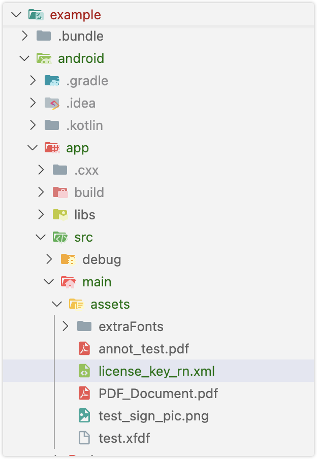
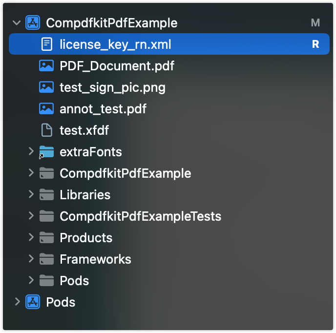

# ComPDFKit React-Native PDF Library

## About

[ComPDFKit for React Native](https://www.compdf.com/react-native), developed by [ComPDF](https://www.compdf.com/), enables developers to quickly and seamlessly integrate advanced PDF features, such as viewing, annotating, editing, and signing PDFs, into any iOS and Android application. And we provide a 30-day free trial license to test your projects

For more information, please visit our [developer guides](https://www.compdf.com/guides/pdf-sdk/react-native/requirements).

## Contents

- [Prerequisites](#prerequisites)
- [Steps to Build a React Native PDF Viewer with ComPDFKit PDF SDK](#steps-to-build-a-react-native-pdf-viewer-with-compdfkit-pdf-sdk)
- [Usage Example](#usage-example)
- [API](#api)
- [Support](#support)

## Prerequisites

Before starting the integration, please ensure the following prerequisites are met:

### Get ComPDFKit License Key

ComPDF offers a [30-day free trial license](https://www.compdf.com/pricing) for testing your project. Get one online without contacting sales.

If you require advanced PDF features beyond the free trial license, please [contact us](https://www.compdf.com/contact-sales) to obtain a commercial license.

### Download the PDF SDK

Download the ComPDFKit ReactNative PDF SDK from [Github](https://github.com/ComPDFKit/compdfkit-pdf-sdk-android) or [NPM](https://www.npmjs.com/package/@compdfkit_pdf_sdk/react_native).

### System Requirements

#### Android

Please install the following required packages:

- A [development environment](https://reactnative.dev/docs/environment-setup) for running React Native projects using the React Native CLI (not the Expo CLI)
- The [latest stable version of Android Studio](https://developer.android.com/studio)
- The [Android NDK](Android%20NDK)
- An [Android Virtual Device](https://developer.android.com/studio/run/managing-avds.html) or a hardware device

Operating Environment Requirements:

- Android minSdkVersion of 21 or higher.
- ComPDFKit SDK 2.0.1 or higher.

#### iOS

Please install the following required packages:

- A [development environment](https://reactnative.dev/docs/environment-setup) for running React Native projects using the React Native CLI (not the Expo CLI)
- The [latest stable version of Xcode](https://apps.apple.com/us/app/xcode/id497799835?mt=12)
- The [latest stable version of CocoaPods](https://github.com/CocoaPods/CocoaPods/releases). Follow the [CocoaPods installation guide](https://guides.cocoapods.org/using/getting-started.html#installation) to install it.

Operating Environment Requirements:

- ComPDFKit SDK 2.0.1 or higher.
- React Native dependency to version 3.0.0 or higher.
- iOS 12.0 or higher.

## Build a React Native PDF Viewer with ComPDFKit PDF SDK

[](https://youtu.be/2ug2nPkuOy4)

### Creating a New Project

Let's create a simple app that integrates ComPDFKit for React Native.

1. In the terminal app, change the current working directory to the location you wish to save your project. In this example, we’ll use the `~/Documents/` directory:

   ```bash
   cd ~/Documents
   ```
2. Create the React Native project by running the following command:

   ```bash
   react-native init MyApp
   ```
3. In the terminal app, change the location of the current working directory inside the newly created project:

   ```bash
   cd MyApp
   ```

#### Expo

If you’re using Expo, refer to the guides post that explains [how to use ComPDFKit ReactNative SDK with Expo](https://www.compdf.com/guides/pdf-sdk/react-native/how-to-use-compdfkit-react-native-sdk-with-expo).

### Installing-the-ComPDFKit-Dependency

You can integrate the SDK in two ways:

* **Through [ComPDFKit GitHub](https://github.com/ComPDFKit/compdfkit-pdf-sdk-react-native) repo:**

  In `MyApp` folder, install `@compdfkit_pdf_sdk/react_native` by calling:

  ```shell
  yarn add github:ComPDFKit/compdfkit-pdf-sdk-react-native
  ```
* **Through [ComPDFKit npm](https://www.npmjs.com/package/@compdfkit_pdf_sdk/react_native) package:**

  In `MyApp` folder, install run the following commands:

  ```
  yarn add @compdfkit_pdf_sdk/react_native
  ```

#### Android

1. open  `android/app/src/main/AndroidManifest.xml` , add  `Internet Permission` and `Storage Permission`：

```diff
<manifest xmlns:android="http://schemas.android.com/apk/res/android"
    package="com.compdfkit.flutter.example">

+    <uses-permission android:name="android.permission.INTERNET"/>

    <!-- Required to read and write documents from device storage -->
+    <uses-permission android:name="android.permission.READ_EXTERNAL_STORAGE"/>
+    <uses-permission android:name="android.permission.WRITE_EXTERNAL_STORAGE"/>

		<!-- Optional settings -->
+    <uses-permission android:name="android.permission.MANAGE_EXTERNAL_STORAGE" />

    <application
+    android:requestLegacyExternalStorage="true"
        ...>
	...
    </application>
</manifest>
```

2. Copy the sample pdf file to the `assets` directory


2. Replace `App.js` (or `App.tsx`) with what is shown for [Usage-Example](#Usage-Example)
3. Finally in the root project directory, run `react-native run-android`.

#### iOS

1. Open your project’s Podfile in a text editor:

```bash
open ios/Podfile
```

2. Add the following line to the `target 'MyApp' do ... end` block:

```diff
target 'MyApp' do
    # ...
+  pod "ComPDFKit", podspec:'https://file.compdf.com/cocoapods/ios/compdfkit_pdf_sdk/2.5.1/ComPDFKit.podspec'
+  pod "ComPDFKit_Tools", podspec:'https://file.compdf.com/cocoapods/ios/compdfkit_pdf_sdk/2.5.1/ComPDFKit_Tools.podspec'
    # ...
end
```

**Note:** If SSL network requests fail to download the `ComPDFKit` library when you run `pod install`, you can use the following method instead.

```diff
target 'MyApp' do
    # ...
+  pod 'ComPDFKit', :git => 'https://github.com/ComPDFKit/compdfkit-pdf-sdk-ios-swift.git', :tag => '2.5.1'
+  pod 'ComPDFKit_Tools', :git => 'https://github.com/ComPDFKit/compdfkit-pdf-sdk-ios-swift.git', :tag => '2.5.1'
    # ...
end
```

3. In the `ios` folder, run `pod install`.
4. Open your project’s Workspace in Xcode:

   ```bash
   open ios/MyApp.xcworkspace
   ```

   Make sure the deployment target is set to 12.0 or higher:

   
5. Add the PDF document you want to display to your application by dragging it into your project. On the dialog that’s displayed, select Finish to accept the default integration options. You can use **"PDF_Document.pdf"** as an example.

   

```
<key>NSCameraUsageDescription</key>
<string>Your consent is required before you could access the function.</string>

<key>NSMicrophoneUsageDescription</key>
<string>Your consent is required before you could access the function.</string>

<key>NSPhotoLibraryAddUsageDescription</key>
<string>Your consent is required before you could access the function.</string>

<key>NSPhotoLibraryUsageDescription</key>
<string>Your consent is required before you could access the function.</string>

<key>NSAppTransportSecurity</key>
<dict>
<key>NSAllowsArbitraryLoads</key>
<true/>
</dict>
```

3. Replace `App.js` (or `App.tsx`) with what is shown for [Usage-Example](#Usage-Example)
4. Finally in the root project directory, run `react-native run-ios`.

### Apply the License Key

If you haven't get a license key, please check out [how to obtain a license key](/guides/pdf-sdk/react-native/requirements).

ComPDFKit PDF SDK currently supports two authentication methods to verify license keys: online authentication and offline authentication.

*Learn about:*

*[What is the authentication mechanism of ComPDFKit&#39;s license?](https://www.compdf.com/faq/authentication-mechanism-of-compdfkit-license)*

*[What are the differences between Online Authentication and Offline Authentication?](https://www.compdf.com/faq/the-differences-between-online-authentication-and-offline-authentication)*

Accurately obtaining the license key is crucial for the application of the license.

**Android**

1. In the email you received, locate the `XML` file containing the license key.
2. Copy the `license_key_rn.xml` file into the following directory:`android/app/src/main/assets/`



3. Initialize the SDK:

```tsx
ComPDFKit.initWithPath('assets://license_key_rn.xml');
```

**iOS**

1. Use Xcode to copy the `license_key_rn.xml`file into your project’s ` ios/`directory.



2. Initialize the SDK:

```tsx
// Copy the license_key_rn_ios.xml file into your iOS project directory (or a readable location):
ComPDFKit.initWithPath('license_key_rn.xml');
```

**Alternative Method**

You can also store the License file in the device’s local storage and initialize the SDK using its file path:

```tsx
// Obtain the License file through the local storage path of the device for initialization
ComPDFKit.initWithPath('/data/data/0/your_packages/files/license_key_rn.xml');
```

## Usage-Example

After installing from NPM or GitHub, replace `App.tsx` with the following code.

Make sure to follow the above steps to copy the sample document into your Android or iOS project.

Here is the sample code for `App.tsx`:

```tsx
/**
 * Copyright © 2014-2025 PDF Technologies, Inc. All Rights Reserved.
 *
 * THIS SOURCE CODE AND ANY ACCOMPANYING DOCUMENTATION ARE PROTECTED BY INTERNATIONAL COPYRIGHT LAW
 * AND MAY NOT BE RESOLD OR REDISTRIBUTED. USAGE IS BOUND TO THE ComPDFKit LICENSE AGREEMENT.
 * UNAUTHORIZED REPRODUCTION OR DISTRIBUTION IS SUBJECT TO CIVIL AND CRIMINAL PENALTIES.
 * This notice may not be removed from this file.
 */

import React, { Component } from 'react';
import {
  SafeAreaView
} from 'react-native';
import { ComPDFKit, CPDFReaderView } from '@compdfkit_pdf_sdk/react_native';
import { Platform } from 'react-native';

type Props = {};

export default class App extends Component<Props> {

  state = {
    versionCode: ''
  }

  constructor(props: Props) {
    super(props)
    this.initialize()
    this.getVersionCode()
  }

  async getVersionCode() {
    // Get the version code of ComPDFKit SDK
    var version = await ComPDFKit.getVersionCode()
    this.setState({
      versionCode: version
    })
  }

  async initialize() {
    // use license file
    var result = await ComPDFKit.initWithPath(Platform.OS == "android" ? "assets://license_key_rn.xml" : "license_key_rn.xml")
    console.log("ComPDFKitRN", "init_:", result)
  }

  /**
     * Open the sample document embedded in Android or iOS project.
     */
  openSample() {
    var samplePDF: string = Platform.OS == 'android' ? 'file:///android_asset/PDF_Document.pdf' : 'PDF_Document.pdf'
    // We provide default UI and PDF property related configurations here, you can modify configuration options according to your needs.
    var config = ComPDFKit.getDefaultConfig({

    })
    ComPDFKit.openDocument(samplePDF, '', config)
  }

  samplePDF = Platform.OS === 'android'
  ? 'file:///android_asset/PDF_Document.pdf'
  : 'PDF_Document.pdf';

  const onPageChanged = (pageIndex : number) =>{
    // console.log('ComPDFKitRN --- onPageChanged:', pageIndex);
  }

  const saveDocument = () => {
    console.log('ComPDFKitRN saveDocument');
  }

  render() {
    return (
      <SafeAreaView style={{ flex: 1 }}>
        <CPDFReaderView
          document={this.samplePDF}
          onPageChanged={onPageChanged}
          saveDocument={saveDocument}
          configuration={ComPDFKit.getDefaultConfig({})}
          style={{ flex: 1 }}
          />
      </SafeAreaView>
    );
  }
}
```

* (Android) For local storage file path:

```tsx
document = '/storage/emulated/0/Download/PDF_document.pdf'
```

* (Android) For content Uri:

```tsx
document = 'content://...'
```

* (Android) For assets path:

```tsx
document = "file:///android_asset/..."
```

* (iOS) For app bundle file path:

```tsx
document = "document.pdf"
```

* (iOS) for URL path:

```tsx
document = "file://xxxx/document.pdf"
```

### Configuration

When rendering a PDF view using the `ComPDFKit.openDocument` method or the `CPDFReaderView` UI component , you have the flexibility to enable or disable certain features or adjust default attribute values for PDF annotations, forms, and more through the `CPDFConfiguration` settings.

For your convenience, you can obtain default attribute values by using the `ComPDFKit.getDefaultConfig({})` method.

The following example demonstrates the configuration settings for some aspects. For more detailed configuration options, refer to [CONFIGURATION](./CONFIGURATION.md) for further information.

1. Set the initial display mode and the list of available modes. The following code shows enabling only the viewer mode and annotations mode:

```tsx
import { ComPDFKit, CPDFViewMode } from '@compdfkit_pdf_sdk/react_native';

var config = ComPDFKit.getDefaultConfig({
  modeConfig:{
    initialViewMode: CPDFViewMode.VIEWER,
    availableViewModes: [
      CPDFViewMode.VIEWER,
      CPDFViewMode.ANNOTATIONS
    ]
  }
})

// Use in Modal View
ComPDFKit.openDocument(samplePDF, '', config)

// Use in UI components
<CPDFReaderView
	document={this.samplePDF}
	configuration={config}
	style={{ flex: 1 }}
/>
```

2. Set the list of enabled annotation types and default annotation attribute values. For example, enable only highlight annotations and set the color and transparency for highlight annotations:

```tsx
import { ComPDFKit, CPDFAnnotationType, CPDFConfigTool } from '@compdfkit_pdf_sdk/react_native';

var config = ComPDFKit.getDefaultConfig({
  annotationsConfig: {
    availableType: [
      CPDFAnnotationType.NOTE
    ],
    availableTools: [
      CPDFConfigTool.SETTING,
      CPDFConfigTool.UNDO,
      CPDFConfigTool.REDO,
    ],
    initAttribute: {
      note: {
        color: '#1460F3',
        alpha: 255
      }
    }
  }
})

// Use in Modal View
ComPDFKit.openDocument(samplePDF, '', config)

// Use in UI components
<CPDFReaderView
	document={this.samplePDF}
	configuration={config}
	style={{ flex: 1 }}
/>
```

3. Set the display mode and page flipping direction:

```tsx
import { ComPDFKit, CPDFDisplayMode } from '@compdfkit_pdf_sdk/react_native';

var config = ComPDFKit.getDefaultConfig({
  readerViewConfig: {
    displayMode: CPDFDisplayMode.DOUBLE_PAGE,
    verticalMode: false
  }
})
// Use in Modal View
ComPDFKit.openDocument(samplePDF, '', config)

// Use in UI components
<CPDFReaderView
	document={this.samplePDF}
	configuration={config}
	style={{ flex: 1 }}
/>
```

## **API**

APIs are available on the [API](API.md)

## Support

[ComPDFKit](https://www.compdf.com/) has a professional R&D team that produces comprehensive technical documentation and guides to help developers. Also, you can get an immediate response when reporting your problems to our support team.

- For detailed information, please visit our [Guides](https://www.compdf.com/guides/pdf-sdk/react-native/overview) page.
- Stay updated with the latest improvements through our [Changelog](https://www.compdf.com/pdf-sdk/changelog-react-native).
- For technical assistance, please reach out to our [Technical Support](https://www.compdf.com/support).
- To get more details and an accurate quote, please contact our [Sales Team](https://compdf.com/contact-us).

Thanks for reading
The [ComPDF](https://www.compdf.com/) Team
