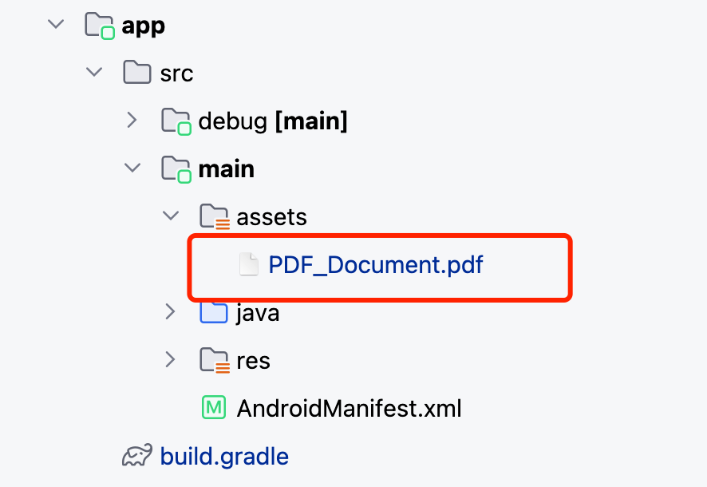
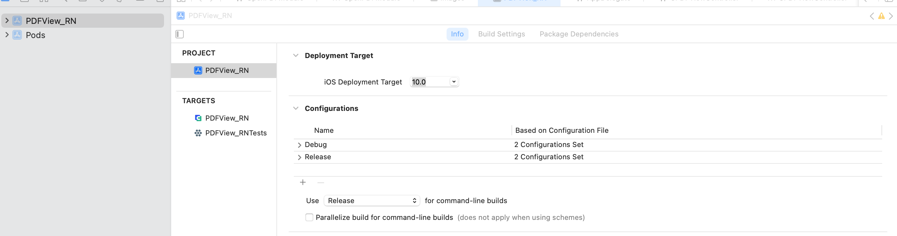
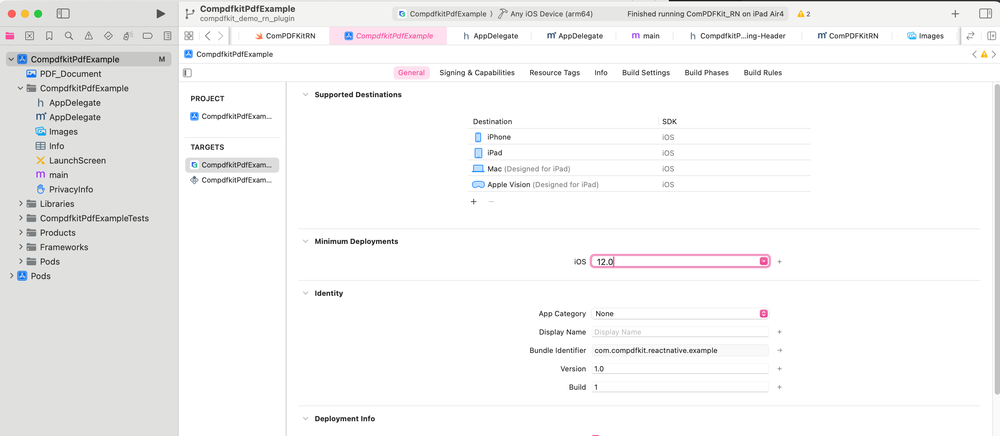
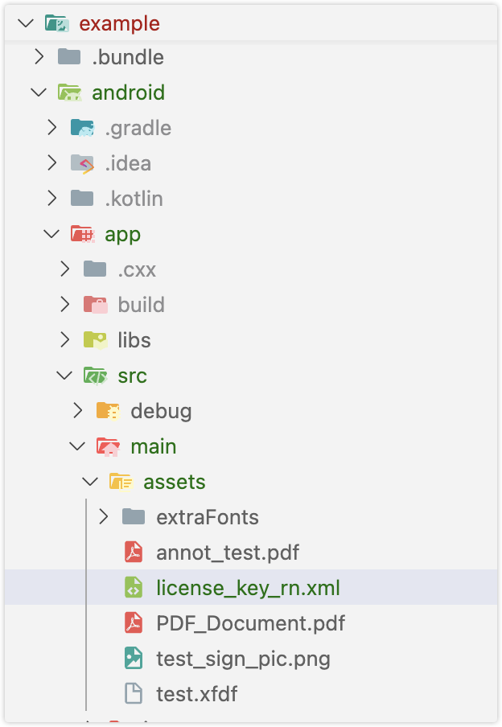
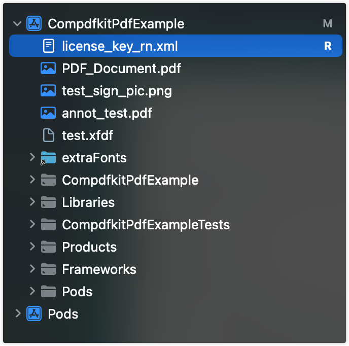

# ComPDF SDK for React Native

As part of the KDAN ecosystem, [ComPDF SDK for React Native](https://www.compdf.com/react-native?utm_source=github_readme_sdk_react_native&utm_medium=referral&utm_campaign=github_readme_sdk_react_native) helps developers add advanced PDF viewing, annotation, editing, and signing features to React Native applications on Android and iOS.

It offers a native-backed React Native integration so teams can deliver mobile PDF workflows without building document tooling from scratch.

[ComPDF SDK](https://www.compdf.com/?utm_source=github_readme_sdk_react_native&utm_medium=referral&utm_campaign=github_readme_sdk_react_native) seamlessly operates on [Web](https://www.compdf.com/web?utm_source=github_readme_sdk_react_native&utm_medium=referral&utm_campaign=github_readme_sdk_react_native), [Windows](https://www.compdf.com/windows?utm_source=github_readme_sdk_react_native&utm_medium=referral&utm_campaign=github_readme_sdk_react_native), [Android](https://www.compdf.com/android?utm_source=github_readme_sdk_react_native&utm_medium=referral&utm_campaign=github_readme_sdk_react_native), [iOS](https://www.compdf.com/ios?utm_source=github_readme_sdk_react_native&utm_medium=referral&utm_campaign=github_readme_sdk_react_native), [Mac](https://www.compdf.com/contact-sales?utm_source=github_readme_sdk_react_native&utm_medium=referral&utm_campaign=github_readme_sdk_react_native), and [Server](https://www.compdf.com/server?utm_source=github_readme_sdk_react_native&utm_medium=referral&utm_campaign=github_readme_sdk_react_native), with support for cross-platform frameworks such as [React Native](https://www.compdf.com/react-native?utm_source=github_readme_sdk_react_native&utm_medium=referral&utm_campaign=github_readme_sdk_react_native), [Flutter](https://www.compdf.com/flutter?utm_source=github_readme_sdk_react_native&utm_medium=referral&utm_campaign=github_readme_sdk_react_native), etc.


If you find ComPDF SDK useful, please consider giving us a ⭐ **Star** on GitHub — it helps us grow and improve! Got questions or ideas? Join the conversation in our [Discussions](https://github.com/ComPDFKit/compdfkit-pdf-sdk-react-native/discussions).


**Why ComPDF SDK for React Native?**

* **Easy to Integrate:** Integrate PDF functionalities easily with our powerful SDK and clear documentation and guides with few lines of code.

* **Fully Customizable UI:** Design a unique interface for your products with fully customizable UI source code by a high-performing SDK.

* **[Comprehensive PDF Features:](https://www.compdf.com/pdf-sdk/features-list?utm_source=github_readme_sdk_react_native&utm_medium=referral&utm_campaign=github_readme_sdk_react_native)** Supports generation, viewing, annotation, page editing, content editing, conversion, OCR, redaction, signing, forms, parsing, measurement, compression, comparison, color separation, batch processing, and more.

* **Faster Time-to-Market:** Comprehensive SDK libraries save your time and expenses and roll out your applications and projects.

* **High-quality Service:** We provide 24/7 professional one-to-one technical support, including onsite service and remote assistance via phone and email.

---

## Table of Contents

- [Related](#related)
- [Requirements](#requirements)
- [Build a React Native PDF Viewer](#build-a-react-native-pdf-viewer)
- [Apply the License Key](#apply-the-license-key)
- [Usage Example](#usage-example)
- [Configuration](#configuration)
- [API](#api)
- [Changelog](#changelog)
- [Free Trial & License](#free-trial)
- [Support](#support)

****

## Related

- [ComPDF SDK for React Native Guides](https://www.compdf.com/guides/pdf-sdk/react-native/overview?utm_source=github_readme_sdk_react_native&utm_medium=referral&utm_campaign=github_readme_sdk_react_native)
- [ComPDF SDK for Flutter](https://github.com/ComPDFKit/compdfkit-pdf-sdk-flutter)
- [ComPDF SDK for iOS](https://github.com/ComPDFKit/compdfkit-pdf-sdk-ios-swift)
- [ComPDF SDK for Android](https://github.com/ComPDFKit/compdfkit-pdf-sdk-android)
- [React Native Package on npm](https://www.npmjs.com/package/@compdfkit_pdf_sdk/react_native)

****

## Requirements

Before starting the integration, please ensure the following prerequisites are met:

### Get ComPDF License Key

ComPDF offers a [30-day free trial license](https://www.compdf.com/pricing?utm_source=github_readme_sdk_react_native&utm_medium=referral&utm_campaign=github_readme_sdk_react_native) for testing your project. Get one online without contacting sales.

If you require advanced PDF features beyond the free trial license, please [contact us](https://www.compdf.com/contact-sales?utm_source=github_readme_sdk_react_native&utm_medium=referral&utm_campaign=github_readme_sdk_react_native) to obtain a commercial license.

### Download the PDF SDK

Download the ComPDF ReactNative PDF SDK from [Github](https://github.com/ComPDFKit/compdfkit-pdf-sdk-android) or [NPM](https://www.npmjs.com/package/@compdfkit_pdf_sdk/react_native).

### System Requirements

#### Android

Please install the following required packages:

- A [development environment](https://reactnative.dev/docs/environment-setup) for running React Native projects using the React Native CLI (not the Expo CLI)
- The [latest stable version of Android Studio](https://developer.android.com/studio)
- The [Android NDK](https://developer.android.com/ndk/downloads) (version 21 or higher)
- An [Android Virtual Device](https://developer.android.com/studio/run/managing-avds.html) or a hardware device

Operating Environment Requirements:

- Android minSdkVersion of 21 or higher.
- ComPDF SDK 2.0.1 or higher.

#### iOS

Please install the following required packages:

- A [development environment](https://reactnative.dev/docs/environment-setup) for running React Native projects using the React Native CLI (not the Expo CLI)
- The [latest stable version of Xcode](https://apps.apple.com/us/app/xcode/id497799835?mt=12)
- The [latest stable version of CocoaPods](https://github.com/CocoaPods/CocoaPods/releases). Follow the [CocoaPods installation guide](https://guides.cocoapods.org/using/getting-started.html#installation) to install it.

Operating Environment Requirements:

- ComPDF SDK 2.0.1 or higher.
- React Native dependency to version 3.0.0 or higher.
- iOS 12.0 or higher.

****

## Build a React Native PDF Viewer

[](https://youtu.be/2ug2nPkuOy4)

### Creating a New Project

Let's create a simple app that integrates ComPDF for React Native.

1. In the terminal app, change the current working directory to the location you wish to save your project. In this example, we’ll use the `~/Documents/` directory:

   ```bash
   cd ~/Documents
   ```

2. Create the React Native project by running the following command:

   ```bash
   react-native init MyApp
   ```

3. In the terminal app, change the location of the current working directory inside the newly created project:

   ```bash
   cd MyApp
   ```

#### Expo

If you’re using Expo, ComPDF requires a development build or EAS Build, so it won’t run inside Expo Go.

Add the official plugin to your Expo config:

```json
{
  "expo": {
    "plugins": ["@compdfkit_pdf_sdk/react_native"]
  }
}
```

Use this plugin-driven flow for Expo and EAS Build instead of manually editing `ios/Podfile`. For the full setup, check out [how to use ComPDF React Native SDK with Expo](https://www.compdf.com/guides/pdf-sdk/react-native/how-to-use-compdfkit-react-native-sdk-with-expo?utm_source=github_readme_sdk_react_native&utm_medium=referral&utm_campaign=github_readme_sdk_react_native).

### Installing-the-ComPDF-Dependency

You can integrate the SDK in two ways:

* **Through [ComPDF GitHub](https://github.com/ComPDFKit/compdfkit-pdf-sdk-react-native) repo:**
  In `MyApp` folder, install `@compdfkit_pdf_sdk/react_native` by calling:

  ```shell
  yarn add github:ComPDFKit/compdfkit-pdf-sdk-react-native
  ```

* **Through [ComPDF npm](https://www.npmjs.com/package/@compdfkit_pdf_sdk/react_native) package:**
  In `MyApp` folder, install run the following commands:

  ```
  yarn add @compdfkit_pdf_sdk/react_native
  ```

#### Android

1. open  `android/app/src/main/AndroidManifest.xml` , add  `Internet Permission` and `Storage Permission`：

```diff
<manifest xmlns:android="http://schemas.android.com/apk/res/android"
    package="com.compdfkit.flutter.example">

+    <uses-permission android:name="android.permission.INTERNET"/>

    <!-- Required to read and write documents from device storage -->
+    <uses-permission android:name="android.permission.READ_EXTERNAL_STORAGE"/>
+    <uses-permission android:name="android.permission.WRITE_EXTERNAL_STORAGE"/>

        <!-- Optional settings -->
+    <uses-permission android:name="android.permission.MANAGE_EXTERNAL_STORAGE" />

    <application
+    android:requestLegacyExternalStorage="true"
        ...>
    ...
    </application>
</manifest>
```

2. Copy the sample pdf file to the `assets` directory



2. Replace `App.js` (or `App.tsx`) with what is shown for [Usage-Example](#Usage-Example)
3. Finally in the root project directory, run `react-native run-android`.

#### iOS

> These Podfile steps are for React Native CLI projects. If you’re using Expo, declare `@compdfkit_pdf_sdk/react_native` in `app.json` and let `expo prebuild` or EAS Build inject the ComPDF pods for you.

1. Open your project’s Podfile in a text editor:

```bash
open ios/Podfile
```

2. Add the following line to the `target 'MyApp' do ... end` block:

```diff
target 'MyApp' do
    # ...
+  pod "ComPDFKit", podspec:'https://file.compdf.com/cocoapods/ios/compdfkit_pdf_sdk/2.6.6/ComPDFKit.podspec'
+  pod "ComPDFKit_Tools", podspec:'https://file.compdf.com/cocoapods/ios/compdfkit_pdf_sdk/2.6.6/ComPDFKit_Tools.podspec'
    # ...
end
```

**Note:** If SSL network requests fail to download the `ComPDFKit` library when you run `pod install`, you can use the following method instead.

```diff
target 'MyApp' do
    # ...
+  pod 'ComPDFKit', :git => 'https://github.com/ComPDFKit/compdfkit-pdf-sdk-ios-swift.git', :tag => '2.6.6'
+  pod 'ComPDFKit_Tools', :git => 'https://github.com/ComPDFKit/compdfkit-pdf-sdk-ios-swift.git', :tag => '2.6.6'
    # ...
end
```

3. In the `ios` folder, run `pod install`.

4. Open your project’s Workspace in Xcode:

   ```bash
   open ios/MyApp.xcworkspace
   ```

   Make sure the deployment target is set to 12.0 or higher:
   

5. Add the PDF document you want to display to your application by dragging it into your project. On the dialog that’s displayed, select Finish to accept the default integration options. You can use **"PDF_Document.pdf"** as an example.
   

```
<key>NSCameraUsageDescription</key>
<string>Your consent is required before you could access the function.</string>

<key>NSMicrophoneUsageDescription</key>
<string>Your consent is required before you could access the function.</string>

<key>NSPhotoLibraryAddUsageDescription</key>
<string>Your consent is required before you could access the function.</string>

<key>NSPhotoLibraryUsageDescription</key>
<string>Your consent is required before you could access the function.</string>

<key>NSAppTransportSecurity</key>
<dict>
<key>NSAllowsArbitraryLoads</key>
<true/>
</dict>
```

3. Replace `App.js` (or `App.tsx`) with what is shown for [Usage-Example](#Usage-Example)
4. Finally in the root project directory, run `react-native run-ios`.

### Apply the License Key

If you haven't get a license key, please check out [how to obtain a license key](/guides/pdf-sdk/react-native/requirements).

ComPDF SDK currently supports two authentication methods to verify license keys: online authentication and offline authentication.

*Learn about:*

*[What is the authentication mechanism of ComPDF?](https://www.compdf.com/faq/authentication-mechanism-of-compdfkit-license?utm_source=github_readme_sdk_react_native&utm_medium=referral&utm_campaign=github_readme_sdk_react_native)*

*[What are the differences between Online Authentication and Offline Authentication?](https://www.compdf.com/faq/the-differences-between-online-authentication-and-offline-authentication?utm_source=github_readme_sdk_react_native&utm_medium=referral&utm_campaign=github_readme_sdk_react_native)*

Accurately obtaining the license key is crucial for the application of the license.

**Android**

1. In the email you received, locate the `XML` file containing the license key.
2. Copy the `license_key_rn.xml` file into the following directory:`android/app/src/main/assets/`



3. Initialize the SDK:

```tsx
ComPDFKit.initWithPath('assets://license_key_rn.xml');
```

**iOS**

1. Use Xcode to copy the `license_key_rn.xml`file into your project’s ` ios/`directory.



2. Initialize the SDK:

```tsx
// Copy the license_key_rn_ios.xml file into your iOS project directory (or a readable location):
ComPDFKit.initWithPath('license_key_rn.xml');
```

**Alternative Method**

You can also store the License file in the device’s local storage and initialize the SDK using its file path:

```tsx
// Obtain the License file through the local storage path of the device for initialization
ComPDFKit.initWithPath('/data/data/0/your_packages/files/license_key_rn.xml');
```

### Usage Example

After installing from NPM or GitHub, replace `App.tsx` with the following code.

Make sure to follow the above steps to copy the sample document into your Android or iOS project.

Here is the sample code for `App.tsx`:

```tsx
/**
 * Copyright © 2014-2026 PDF Technologies, Inc. All Rights Reserved.
 *
 * THIS SOURCE CODE AND ANY ACCOMPANYING DOCUMENTATION ARE PROTECTED BY INTERNATIONAL COPYRIGHT LAW
 * AND MAY NOT BE RESOLD OR REDISTRIBUTED. USAGE IS BOUND TO THE ComPDFKit LICENSE AGREEMENT.
 * UNAUTHORIZED REPRODUCTION OR DISTRIBUTION IS SUBJECT TO CIVIL AND CRIMINAL PENALTIES.
 * This notice may not be removed from this file.
 */

import React, { Component } from 'react';
import {
  SafeAreaView
} from 'react-native';
import { ComPDFKit, CPDFReaderView } from '@compdfkit_pdf_sdk/react_native';
import { Platform } from 'react-native';

type Props = {};

export default class App extends Component<Props> {

  state = {
    versionCode: ''
  }

  constructor(props: Props) {
    super(props)
    this.initialize()
    this.getVersionCode()
  }

  async getVersionCode() {
    // Get the version code of ComPDFKit SDK
    var version = await ComPDFKit.getVersionCode()
    this.setState({
      versionCode: version
    })
  }

  async initialize() {
    // use license file
    var result = await ComPDFKit.initWithPath(Platform.OS == "android" ? "assets://license_key_rn.xml" : "license_key_rn.xml")
    console.log("ComPDFKitRN", "init_:", result)
  }

  /**
     * Open the sample document embedded in Android or iOS project.
     */
  openSample() {
    var samplePDF: string = Platform.OS == 'android' ? 'file:///android_asset/PDF_Document.pdf' : 'PDF_Document.pdf'
    // We provide default UI and PDF property related configurations here, you can modify configuration options according to your needs.
    var config = ComPDFKit.getDefaultConfig({

    })
    ComPDFKit.openDocument(samplePDF, '', config)
  }

  samplePDF = Platform.OS === 'android'
  ? 'file:///android_asset/PDF_Document.pdf'
  : 'PDF_Document.pdf';

  const onPageChanged = (pageIndex : number) =>{
    // console.log('ComPDFKitRN --- onPageChanged:', pageIndex);
  }

  const saveDocument = () => {
    console.log('ComPDFKitRN saveDocument');
  }

  render() {
    return (
      <SafeAreaView style={{ flex: 1 }}>
        <CPDFReaderView
          document={this.samplePDF}
          onPageChanged={onPageChanged}
          saveDocument={saveDocument}
          configuration={ComPDFKit.getDefaultConfig({})}
          style={{ flex: 1 }}
          />
      </SafeAreaView>
    );
  }
}
```

* (Android) For local storage file path:

```tsx
document = '/storage/emulated/0/Download/PDF_document.pdf'
```

* (Android) For content Uri:

```tsx
document = 'content://...'
```

* (Android) For assets path:

```tsx
document = "file:///android_asset/..."
```

* (iOS) For app bundle file path:

```tsx
document = "document.pdf"
```

* (iOS) for URL path:

```tsx
document = "file://xxxx/document.pdf"
```

### Configuration

When rendering a PDF view using the `ComPDFKit.openDocument` method or the `CPDFReaderView` UI component , you have the flexibility to enable or disable certain features or adjust default attribute values for PDF annotations, forms, and more through the `CPDFConfiguration` settings.

For your convenience, you can obtain default attribute values by using the `ComPDFKit.getDefaultConfig({})` method.

The following example demonstrates the configuration settings for some aspects. For more detailed configuration options, refer to [CONFIGURATION](./CONFIGURATION.md) for further information.

1. Set the initial display mode and the list of available modes. The following code shows enabling only the viewer mode and annotations mode:

```tsx
import { ComPDFKit, CPDFViewMode } from '@compdfkit_pdf_sdk/react_native';

var config = ComPDFKit.getDefaultConfig({
  modeConfig:{
    initialViewMode: CPDFViewMode.VIEWER,
    availableViewModes: [
      CPDFViewMode.VIEWER,
      CPDFViewMode.ANNOTATIONS
    ]
  }
})

// Use in Modal View
ComPDFKit.openDocument(samplePDF, '', config)

// Use in UI components
<CPDFReaderView
    document={this.samplePDF}
    configuration={config}
    style={{ flex: 1 }}
/>
```

2. Set the list of enabled annotation types and default annotation attribute values. For example, enable only highlight annotations and set the color and transparency for highlight annotations:

```tsx
import { ComPDFKit, CPDFAnnotationType, CPDFConfigTool } from '@compdfkit_pdf_sdk/react_native';

var config = ComPDFKit.getDefaultConfig({
  annotationsConfig: {
    availableType: [
      CPDFAnnotationType.NOTE
    ],
    availableTools: [
      CPDFConfigTool.SETTING,
      CPDFConfigTool.UNDO,
      CPDFConfigTool.REDO,
    ],
    initAttribute: {
      note: {
        color: '#1460F3',
        alpha: 255
      }
    }
  }
})

// Use in Modal View
ComPDFKit.openDocument(samplePDF, '', config)

// Use in UI components
<CPDFReaderView
    document={this.samplePDF}
    configuration={config}
    style={{ flex: 1 }}
/>
```

3. Set the display mode and page flipping direction:

```tsx
import { ComPDFKit, CPDFDisplayMode } from '@compdfkit_pdf_sdk/react_native';

var config = ComPDFKit.getDefaultConfig({
  readerViewConfig: {
    displayMode: CPDFDisplayMode.DOUBLE_PAGE,
    verticalMode: false
  }
})
// Use in Modal View
ComPDFKit.openDocument(samplePDF, '', config)

// Use in UI components
<CPDFReaderView
    document={this.samplePDF}
    configuration={config}
    style={{ flex: 1 }}
/>
```

---

## API

APIs are available on the [API](API.md)

---

## Changelog

Keep up with the latest updates, improvements, and bug fixes for ComPDF SDK for React Native: [View React Native Changelog](https://www.compdf.com/pdf-sdk/changelog-react-native?utm_source=github_readme_sdk_react_native&utm_medium=referral&utm_campaign=github_readme_sdk_react_native)

---

## Free Trial

[ComPDF SDK for React Native](https://www.compdf.com/?utm_source=github_readme_sdk_react_native&utm_medium=referral&utm_campaign=github_readme_sdk_react_native) offers a **30-day free trial** so you can evaluate core PDF capabilities in your own application.

To get started:

1. Apply for a [free trial](https://www.compdf.com/pricing?utm_source=github_readme_sdk_react_native&utm_medium=referral&utm_campaign=github_readme_sdk_react_native)
2. Review supported trial features and licensing details
3. Follow the integration and license steps above to activate the SDK in your project

For custom deployments, advanced features, or volume licensing, please [contact our sales team](https://www.compdf.com/contact-sales?utm_source=github_readme_sdk_react_native&utm_medium=referral&utm_campaign=github_readme_sdk_react_native)

---

## Support

[ComPDF](https://www.compdf.com/?utm_source=github_readme_sdk_react_native&utm_medium=referral&utm_campaign=github_readme_sdk_react_native) has a professional R&D team that produces comprehensive technical documentation and guides to help developers. Also, you can get an immediate response when reporting your problems to our support team.

- For detailed information, please visit our [Guides](https://www.compdf.com/guides/pdf-sdk/react-native/overview?utm_source=github_readme_sdk_react_native&utm_medium=referral&utm_campaign=github_readme_sdk_react_native) page.
- For technical assistance, please reach out to our [Technical Support](https://www.compdf.com/support?utm_source=github_readme_sdk_react_native&utm_medium=referral&utm_campaign=github_readme_sdk_react_native).
- To get more details and an accurate quote, please contact our [Sales Team](https://www.compdf.com/contact-sales?utm_source=github_readme_sdk_react_native&utm_medium=referral&utm_campaign=github_readme_sdk_react_native) or [send an email](mailto:support@compdf.com).
