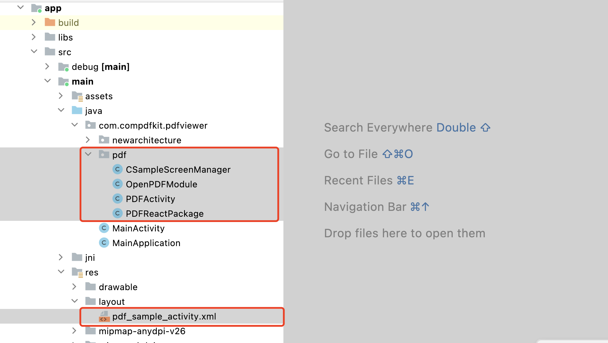
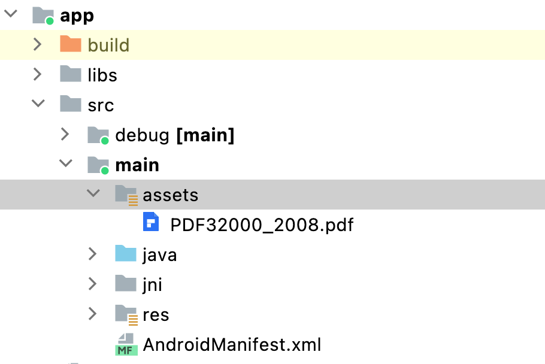
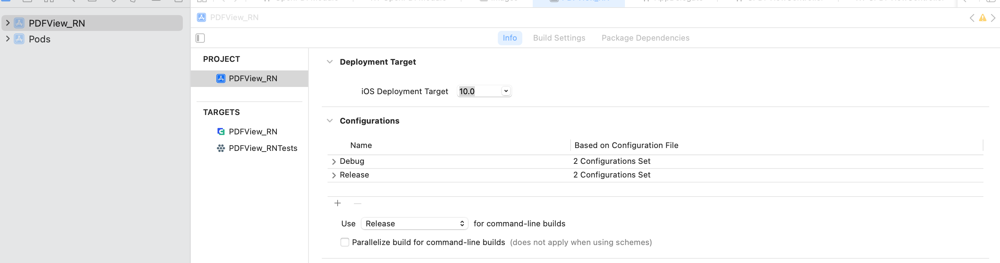
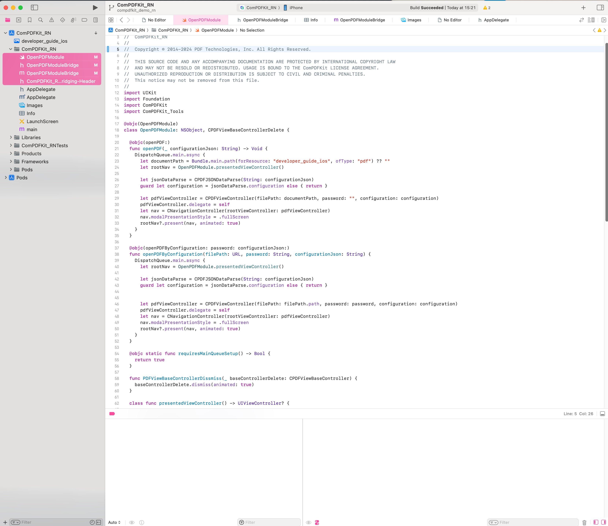
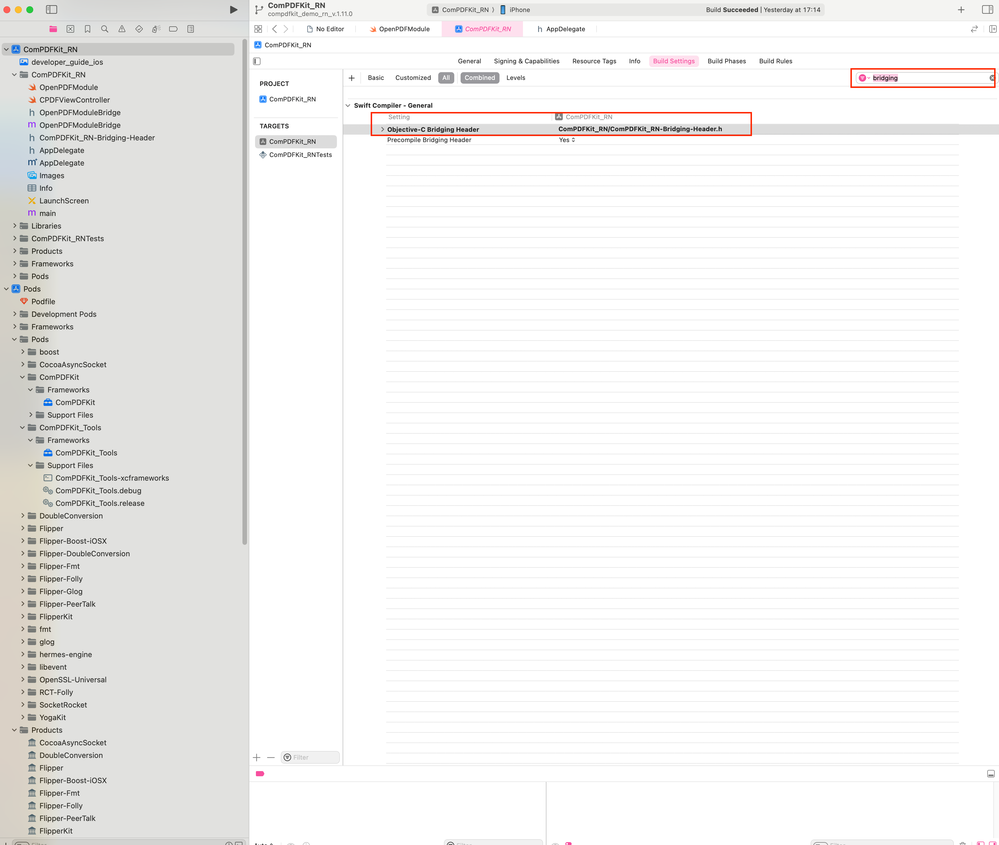
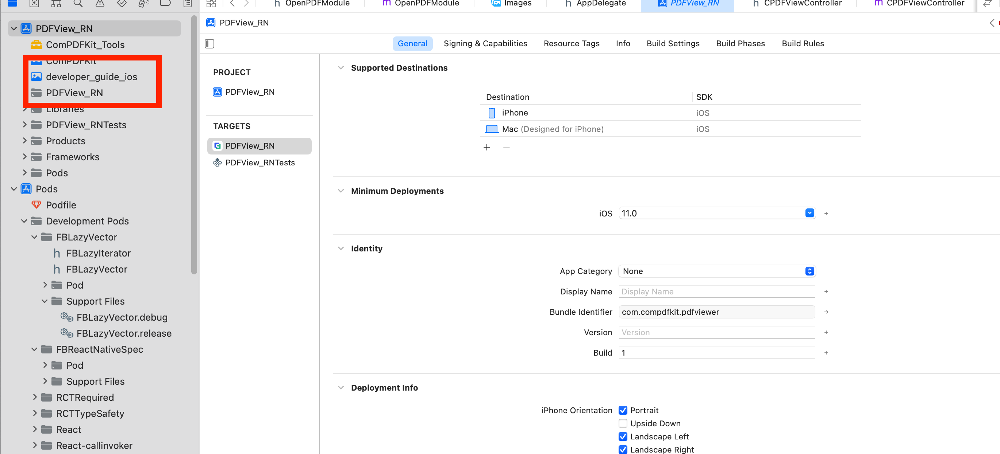
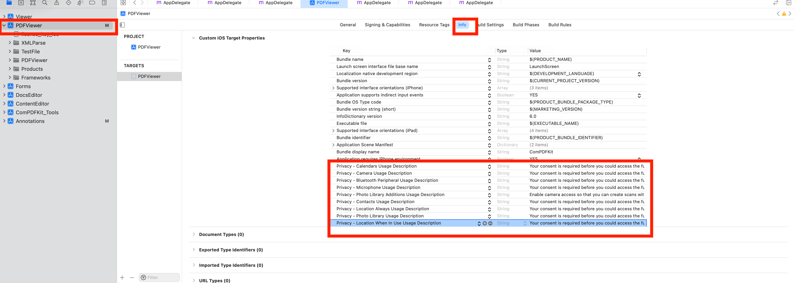
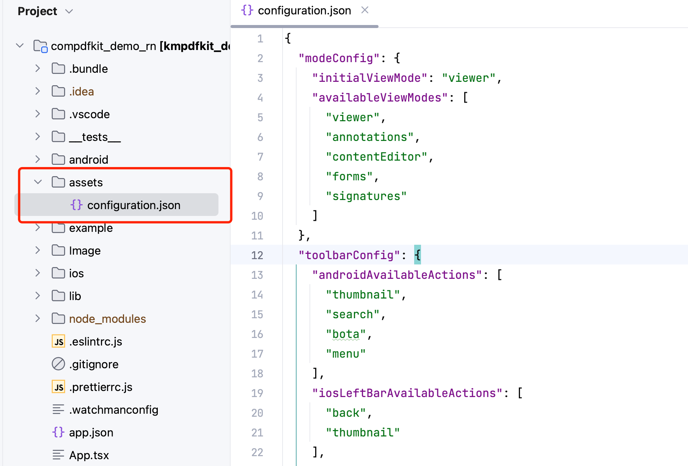

# ComPDFKit React-Native PDF Library

## Overview

[ComPDFKit PDF SDK](https://www.compdf.com/) is a robust PDF library, which offers comprehensive functions for quickly viewing, annotating, editing, and signing PDFs. It is feature-rich and battle-tested, making PDF files process and manipulation easier and faster.

[ComPDFKit for React Native](https://www.compdf.com/react-native) allows you to quickly add PDF functions to any Flutter application, elevating your Android and iOS apps to ensure seamless and efficient development.   


## Related

- [ComPDFKit PDF Library for iOS](https://github.com/ComPDFKit/PDF-SDK-iOS)
- [ComPDFKit PDF Library for Android](https://github.com/ComPDFKit/PDF-SDK-Android)
- ComPDFKit PDF SDK - [Flutter Library](https://pub.dev/packages/compdfkit_flutter)
- [How to Build a React Native PDF Viewer](https://www.compdf.com/blog/build-a-react-native-pdf-viewer)
- [React Native & ComPDFKit PDF SDK](https://www.compdf.com/blog/react-native-and-compdfkit-pdf-sdk)
- [ComPDFKit API](https://api.compdf.com/api/pricing) allows you to get 1000 files processing monthly now! Just [sign up](https://api.compdf.com/signup) for a free trial and enjoy comprehensive PDF functions.

## Key Features

- [**Viewer**](https://www.compdf.com/pdf-sdk/viewer) component offers Standard page display modes, Navigation, Text search & selection, Zoom in and out & Fit-page, Text reflow, and more.
- [**Annotations**](https://www.compdf.com/pdf-sdk/annotations) component offers Note, Link, Free Text, Line, Square, Circle, Highlight, Underline, Squiggly, Strikeout, Stamp, Ink, Sound, and more.
- [**Forms**](https://www.compdf.com/pdf-sdk/forms) component offers Push Button, Check Box, Radio Button, Text Field, Combo Box, List Box, Signature, and more.
- [**Document Editor**](https://www.compdf.com/pdf-sdk/document-editor) component offers Split, Extract, Merge, Delete, Insert, Crop, Move, Rotate, Replace, and Exchange pages, etc.
- [**Content Editor**](https://www.compdf.com/pdf-sdk/edit-pdf) component offers Copy, Resize, Change Colors, Text Alignment, Find and Replace, etc.
- [**Security**](https://www.compdf.com/pdf-sdk/security) component offers Encrypt and Decrypt PDFs, Watermark, etc.

If you want to know all the features that ComPDFKit SDK can offer, please see our [Feature List](https://www.compdf.com/pdf-sdk/features-list).


## Get Started

It's easy to embed ComPDFKit into React Native applications with a few lines of code. The following sections describe the optimal systems and environments to support, as well as quick integration steps. Let's take a few minutes to get started.


### Requirements

**Android**

Please install the following required packages:

* A [development environment](https://reactnative.dev/docs/environment-setup) for running React Native projects using the React Native CLI (not the Expo CLI)

* [The latest stable version of Android Studio](https://developer.android.com/studio)

* The [Android NDK](https://developer.android.com/studio/projects/install-ndk)

* An [Android Virtual Device](https://developer.android.com/studio/run/managing-avds.html) or a hardware device

Operating Environment Requirements:

* Android `minSdkVersion` of `21` or higher.
* ComPDFKit SDK 1.9.0 or higher.

**iOS**

Please install the following required packages:

* A [development environment](https://reactnative.dev/docs/environment-setup) for running React Native projects using the React Native CLI (not the Expo CLI)

* [The latest stable version of Xcode](https://apps.apple.com/us/app/xcode/id497799835?mt=12)

* [The latest stable version of CocoaPods](https://github.com/CocoaPods/CocoaPods/releases). Follow the [CocoaPods installation guide](https://guides.cocoapods.org/using/getting-started.html#installation) to install it.

Operating Environment Requirements:

* ComPDFKit SDK 1.9.0 or higher.
* React Native dependency to version 3.0.0 or higher.
* iOS 10.0 or higher.


### How to Run a Demo

[ComPDFKit PDF SDK for React-Native](https://www.compdf.com/guides/pdf-sdk/react-native/overview) provides a complete functional demonstration, you can view the sample project in the **Example** folder.

1. Enter the sample project directory in the `terminal` software

```
cd Downloads/compdfkit-sdk-pdf-react-native/example
```

2. Execute the `yarn install` command to obtain the software package

**Android**

Execute the following command to run on the Android device

```
yarn android
```

**iOS**

1. Open your project's Podfile in a text editor:

```bash
open ios/Podfile
```

2. Update the platform to iOS 11 and add the ComPDFKit Podspec:

```diff
require_relative '../node_modules/react-native/scripts/react_native_pods'
require_relative '../node_modules/@react-native-community/cli-platform-ios/native_modules'

- platform :ios, '10.0'
+ platform :ios, '11.0'
install! 'cocoapods', :deterministic_uuids => false

target 'PDFView_RN' do
  config = use_native_modules!

  # Flags change depending on the env values.
  flags = get_default_flags()

  use_react_native!(
    :path => config[:reactNativePath],
    # to enable hermes on iOS, change `false` to `true` and then install pods
    :hermes_enabled => flags[:hermes_enabled],
    :fabric_enabled => flags[:fabric_enabled],
    # An absolute path to your application root.
    :app_path => "#{Pod::Config.instance.installation_root}/.."
  )

  target 'PDFView_RNTests' do
    inherit! :complete
    # Pods for testing
  end

+  pod 'ComPDFKit_Tools', podspec:'https://www.compdf.com/download/ios/cocoapods/xcframeworks/compdfkit_tools/2.0.1.podspec'
+  pod 'ComPDFKit', podspec:'https://www.compdf.com/download/ios/cocoapods/xcframeworks/compdfkit/2.0.1.podspec'

  # Enables Flipper.
  #
  # Note that if you have use_frameworks! enabled, Flipper will not work and
  # you should disable the next line.
  use_flipper!()

  post_install do |installer|
    react_native_post_install(installer)
    __apply_Xcode_12_5_M1_post_install_workaround(installer)
  end
end
```

3. Go to the **example/ios** folder and run the `pod install` command:

```bash
pod install
```

4. Go to the **example** folder and the app is now ready to launch! Go back to the terminal.

```bash
//Run on iOS emulator
npx react-native run-ios
```


### Integrate into a new React-Native APP

Let's create a simple app that integrates ComPDFKit for React Native.

1. In the terminal app, change the current working directory to the location you wish to save your project. In this example, we’ll use the `~/Documents/` directory:

   ```bash
   cd ~/Documents
   ```

2. Create the React Native project by running the following command:

   ```bash
   react-native init compdfkit_rn
   ```

3. In the terminal app, change the location of the current working directory inside the newly created project:

   ```bash
   cd compdfkit_rn
   ```

4. Add the ComPDFKit library and import the presented PDF document.

#### For Android

1. Open the **android/build.gradle** file located in the project root directory and add the `mavenCentral` repository:

```diff
repositories {
    google()
+   mavenCentral()
}
```

2. Open the app's Gradle build file, `android/app/build.gradle`:

```bash
open android/app/build.gradle
```

3. Modify the minimum SDK version, All this is done inside the `android` section:

```diff
 android {
     defaultConfig {
-        minSdkVersion rootProject.ext.minSdkVersion
+        minSdkVersion 21
         ...
     }
 }
```

4. Add ComPDFKit SDK inside the dependencies section:

```diff
dependencies {
    ...
+    implementation 'com.compdf:compdfkit:2.0.1'
+    implementation 'com.compdf:compdfkit-ui:2.0.1'
+    implementation 'com.compdf:compdfkit-tools:2.0.1'
}
```

5. Add Proguard Rules, In the **proguard-rules.pro** file, please add the obfuscation configuration information for `compdfkit` as follows:

```
-keep class com.compdfkit.ui.** {*;}
-keep class com.compdfkit.core.** {*;}
-keep class com.compdfkit.tools.** {*;}
```

6. open  **android/app/src/main/AndroidManifest.xml** , add  `Internet Permission`  and `Storage Permission`:

```diff
<manifest xmlns:android="http://schemas.android.com/apk/res/android"
    package="com.compdfkit.flutter.example">
    
+    <uses-permission android:name="android.permission.INTERNET"/>
    
    <!-- Required to read and write documents from device storage -->
+    <uses-permission android:name="android.permission.READ_EXTERNAL_STORAGE"/>
+    <uses-permission android:name="android.permission.WRITE_EXTERNAL_STORAGE"/>

		<!-- Optional settings -->
+    <uses-permission android:name="android.permission.MANAGE_EXTERNAL_STORAGE" />

    <application
+    android:requestLegacyExternalStorage="true"
        ...>
        ...
    </application>
</manifest>
```

7. Copy the **pdf** folder  code from the sample project Android project to your project



9. Open the **MainApplication** file and fill in the following code in the `getPackages()` method

```diff
@Override
protected List<ReactPackage> getPackages() {
  @SuppressWarnings("UnnecessaryLocalVariable")
  List<ReactPackage> packages = new PackageList(this).getPackages();
+  packages.add(new PDFReactPackage());
  return packages;
}
```

10. Copy the sample pdf file to the `assets` directory




#### For iOS

1. Open your project's Podfile in a text editor:


```bash
open ios/Podfile
```

2. Update the platform to iOS 11 and add the ComPDFKit Podspec:

```diff
require_relative '../node_modules/react-native/scripts/react_native_pods'
require_relative '../node_modules/@react-native-community/cli-platform-ios/native_modules'

- platform :ios, '10.0'
+ platform :ios, '11.0'
install! 'cocoapods', :deterministic_uuids => false

target 'PDFView_RN' do
  config = use_native_modules!

  # Flags change depending on the env values.
  flags = get_default_flags()

  use_react_native!(
    :path => config[:reactNativePath],
    # to enable hermes on iOS, change `false` to `true` and then install pods
    :hermes_enabled => flags[:hermes_enabled],
    :fabric_enabled => flags[:fabric_enabled],
    # An absolute path to your application root.
    :app_path => "#{Pod::Config.instance.installation_root}/.."
  )

  target 'PDFView_RNTests' do
    inherit! :complete
    # Pods for testing
  end

+  pod 'ComPDFKit_Tools', podspec:'https://www.compdf.com/download/ios/cocoapods/xcframeworks/compdfkit_tools/2.0.1.podspec'
+  pod 'ComPDFKit', podspec:'https://www.compdf.com/download/ios/cocoapods/xcframeworks/compdfkit/2.0.1.podspec'

  # Enables Flipper.
  #
  # Note that if you have use_frameworks! enabled, Flipper will not work and
  # you should disable the next line.
  use_flipper!()

  post_install do |installer|
    react_native_post_install(installer)
    __apply_Xcode_12_5_M1_post_install_workaround(installer)
  end
end
```

3. Go to the **compdfkit_rn/ios** folder and run the `pod install` command:

```bash
pod install
```

**Note:** If SSL network requests fail to download the `ComPDFKit` library when you run `pod install`, you can see the processing method in [Troubleshooting](#Troubleshooting).

4. Open your project's Workspace in Xcode:

```bash
open ios/PDFView_RN.xcworkspace	
```

5. Make sure the deployment target is set to 10.0 or higher:



6. Import resource file，***"OpenPDFModule.swift"*** is the bridging file for connecting React Native to the iOS native module.



7. Search for **bridging** in the **Build Settings** and locate the **Objective-C Bridging Header** option. Then, enter the file path of the header file ***"ComPDFKit_RN-Bridging-Header.h"***: 



8. Add the PDF document you want to display to your application by dragging it into your project. On the dialog that's displayed, select Finish to accept the default integration options. You can use "developer_guide_ios.pdf" as an example.



9. To protect user privacy, before accessing the sensitive privacy data, you need to find the ***"Info"*** configuration in your iOS 10.0 or higher iOS project and configure the relevant privacy terms as shown in the following picture.



```objective-c
<key>NSCameraUsageDescription</key>
<string>Your consent is required before you could access the function.</string>

<key>NSMicrophoneUsageDescription</key>
<string>Your consent is required before you could access the function.</string>

<key>NSPhotoLibraryAddUsageDescription</key>
<string>Your consent is required before you could access the function.</string>

<key>NSPhotoLibraryUsageDescription</key>
<string>Your consent is required before you could access the function.</string>
  
<key>NSAppTransportSecurity</key>
	<dict>
		<key>NSAllowsArbitraryLoads</key>
	<true/>
</dict>
```

### Apply the License Key

ComPDFKit for React Native is a commercial SDK, which requires a license to grant developer permission to release their apps. Each license is only valid for one `bundle ID` or `applicationId` in development mode. Other flexible licensing options are also supported, please contact [our marketing team](mailto:support@compdf.com) to know more.

To initialize ComPDFKit using a license key, call either of the following before using any other ComPDFKit APIs or features:

* **Online license**

```tsx
type Props = {};
export default class App extends Component<Props> {
	...
  
  componentDidMount(){
    // Fill in your online license
    NativeModules.OpenPDFModule.initialize('your android platform compdfkit license', 'your ios platform compdfkit license')
  }
  // ...
}
```

* **Offline license**

```tsx
type Props = {};
export default class App extends Component<Props> {
	...
  
  componentDidMount(){
    // Fill in your offline license
    NativeModules.OpenPDFModule.init_('your compdfkit license')
  }
  // ...
}
```

### Run Project

1. Create an `assets` directory in the project's root directory and copy the **[configuration.json](./assets/configuration.json)** file from the demo to this directory.



2. Open your `App.tsx` file:

```bash
open App.tsx
```

3. Replace the entire contents of `App.tsx` with the following code snippet:

```js
/**
 * Copyright © 2014-2024 PDF Technologies, Inc. All Rights Reserved.
 *
 * THIS SOURCE CODE AND ANY ACCOMPANYING DOCUMENTATION ARE PROTECTED BY INTERNATIONAL COPYRIGHT LAW
 * AND MAY NOT BE RESOLD OR REDISTRIBUTED. USAGE IS BOUND TO THE ComPDFKit LICENSE AGREEMENT.
 * UNAUTHORIZED REPRODUCTION OR DISTRIBUTION IS SUBJECT TO CIVIL AND CRIMINAL PENALTIES.
 * This notice may not be removed from this file.
 */

import React, { Component } from 'react';
import configuration from './assets/configuration.json';
import DocumentPicker from 'react-native-document-picker'
import {
  Platform,
  StyleSheet,
  Text,
  View,
  Button,
  NativeModules
} from 'react-native';


const instructions = Platform.select({
  ios: 'Press Cmd+R to reload,\n' +
    'Cmd+D or shake for dev menu',
  android: 'Double tap R on your keyboard to reload,\n' +
    'Shake or press menu button for dev menu',
});


type Props = {};
export default class App extends Component<Props> {
  
   componentDidMount(){
      // Fill in your online license
         NativeModules.OpenPDFModule.initialize('your android platform compdfkit license', 'your ios platform compdfkit license')
    
      // Fill in your offline license
      // NativeModules.OpenPDFModule.init_('your compdfkit license')
  }
  
  render() {
    return (
      <View style={styles.container}>
        <Text style={styles.welcome}>
          Welcome to React Native!
        </Text>
        <Text style={styles.instructions}>
          To get started, edit App.tsx
        </Text>
        <Text style={styles.instructions}>
          {instructions}
        </Text>
        <Button
          title={'Open sample document'}
          onPress={() => {
            this.jumpToNativeView();
          }}
        />
        <View style={{margin:5}}/>
        <Button 
          title={'pick document'}
          onPress={() => {
            try {
              const pickerResult = DocumentPicker.pick({
                type: [DocumentPicker.types.pdf]
              });
              pickerResult.then(res => {
                if (Platform.OS == 'android') {
                  // only android
                  NativeModules.OpenPDFModule.openPDFByUri(res[0].uri, '', JSON.stringify(configuration))
                } else {
                  NativeModules.OpenPDFModule.openPDFByConfiguration(res[0].uri, '', JSON.stringify(configuration))
                }
              })
            } catch (err) {
            }
          }}
        />
      </View>
    );
  }

  jumpToNativeView() {
    NativeModules.OpenPDFModule.openPDF(JSON.stringify(configuration))

    // android: filePath, ios:URL
    // NativeModules.OpenPDFModule.openPDFByConfiguration(filePath, password, JSON.stringify(configuration))

    // only android platform
    // NativeModules.OpenPDFModule.openPDFByUri(uriString, password, JSON.stringify(configuration))
  }
}

const styles = StyleSheet.create({
  container: {
    flex: 1,
    justifyContent: 'center',
    alignItems: 'center',
    backgroundColor: '#F5FCFF',
  },
  welcome: {
    fontSize: 20,
    textAlign: 'center',
    margin: 10,
  },
  instructions: {
    textAlign: 'center',
    color: '#333333',
    marginBottom: 5,
  }
});
```

4. Go to the **example** folder and the app is now ready to launch! Go back to the terminal.

```bash
//Run on Android devices
npx react-native run-android

//Run on iOS devices
npx react-native run-ios
```


## Example APP

To see [ComPDFKit for React-Native](https://www.compdf.com/contact-sales) in action, check out our [React-Native example app](./example)

Showing a PDF document inside your React-Native app is as simple as this:

```tsx
// Open the default document directly
NativeModules.OpenPDFModule.openPDF(JSON.stringify(configuration))

// Open the document in the specified path
// The ios platform can use this method to pass in the url string
NativeModules.OpenPDFModule.openPDFByConfiguration(String filePath, String password, String configuration)

// Opening a document using Uri on the Android platform.
NativeModules.OpenPDFModule.openPDFByUri(String uriString, String password, String configuration)
```


## Troubleshooting

1.SSL network request to download 'ComPDFKit' library failed when cocopods downloaded iOS third-party library

If SSL network requests fail to download the `ComPDFKit` library when you run `pod install`, replace the third-party platform download address link of the ComPDFKit library and execute `pod install`

```diff
require_relative '../node_modules/react-native/scripts/react_native_pods'
require_relative '../node_modules/@react-native-community/cli-platform-ios/native_modules'

- platform :ios, '10.0'
+ platform :ios, '11.0'
install! 'cocoapods', :deterministic_uuids => false

target 'PDFView_RN' do
  config = use_native_modules!

  # Flags change depending on the env values.
  flags = get_default_flags()

  use_react_native!(
    :path => config[:reactNativePath],
    # to enable hermes on iOS, change `false` to `true` and then install pods
    :hermes_enabled => flags[:hermes_enabled],
    :fabric_enabled => flags[:fabric_enabled],
    # An absolute path to your application root.
    :app_path => "#{Pod::Config.instance.installation_root}/.."
  )

  target 'PDFView_RNTests' do
    inherit! :complete
    # Pods for testing
  end

+  pod 'ComPDFKit', :git => 'https://github.com/ComPDFKit/compdfkit-pdf-sdk-ios-swift.git', :tag => '2.0.1'
+  pod 'ComPDFKit_Tools', :git => 'https://github.com/ComPDFKit/compdfkit-pdf-sdk-ios-swift.git', :tag => '2.0.1'

  # Enables Flipper.
  #
  # Note that if you have use_frameworks! enabled, Flipper will not work and
  # you should disable the next line.
  use_flipper!()

  post_install do |installer|
    react_native_post_install(installer)
    __apply_Xcode_12_5_M1_post_install_workaround(installer)
  end
end
```


## Support

[ComPDFKit](https://www.compdf.com/) has a professional R&D team that produces comprehensive technical documentation and guides to help developers. Also, you can get an immediate response when reporting your problems to our support team.

- For detailed information, please visit our [Guides](https://www.compdf.com/guides/pdf-sdk/flutter/overview) page.
- Stay updated with the latest improvements through our [Changelog](https://www.compdf.com/pdf-sdk/changelog-flutter).
- For technical assistance, please reach out to our [Technical Support](https://www.compdf.com/support).
- To get more details and an accurate quote, please contact our [Sales Team](https://compdf.com/contact-us).


## License

ComPDFKit PDF SDK supports flexible licensing options, please contact [our sales team](mailto:support@compdf.com) to know more. Each license is only valid for one application ID in development mode. However, any documents, sample code, or source code distribution from the released package of ComPDFKit PDF SDK to any third party is prohibited.


## Note

We are glad to announce that you can register a ComPDFKit API account for a [free trial](https://api.compdf.com/api/pricing) to process 1000 documents per month for free.

Thanks, 

The ComPDFKit Team
